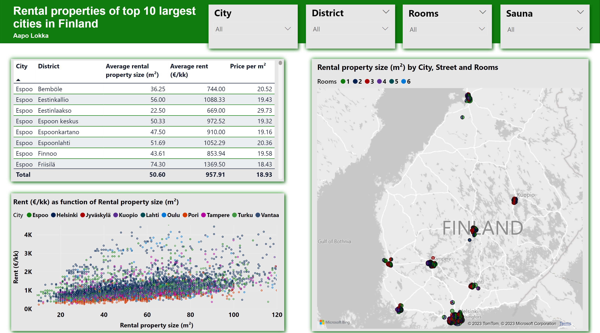
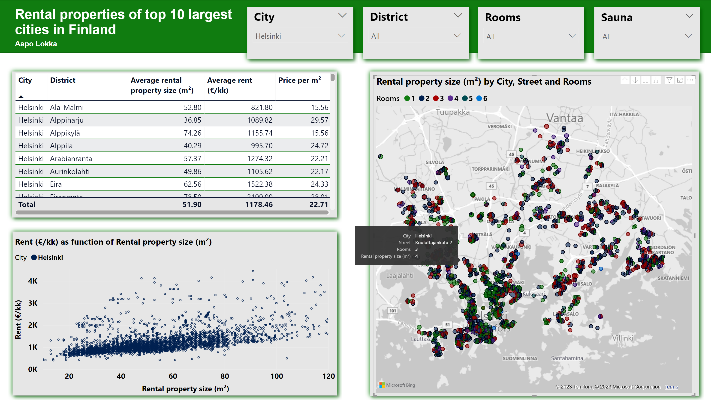
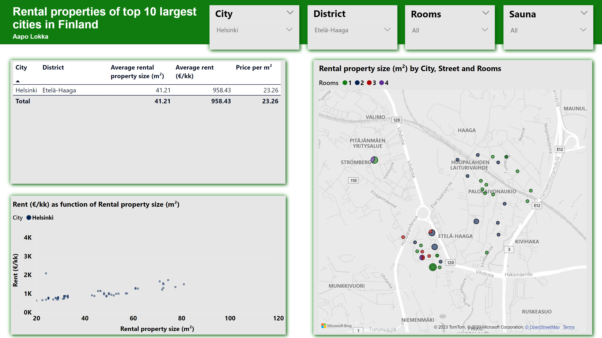

# Rental properties of top 10 largest cities in Finland

## Introduction 

In this project, the goal was to learn web scraping and Power BI. Basic idea was to scrape rental apartments data of top ten largest cities in Finland from _vuokaraovi.com_ (Finnish apartment rental webpage). Technology wise, scraping was performed by using `BeautifulSoup` python library. Scraped data was handled and cleaned  with `pandas`. Finally, the data presentation was performed by using Power Bi dashboard.  

## Power BI dashboard images

In Power BI dashboard user can choose from the city, district, number of rooms, and whether there is sauna or not. Based on these paremeters, dashboard includes a table that shows city, district, average rental property size, average rent and prize per square meter. Additionally, there is a figure that shows rent proce as a function of rental property size of chosen rental apartment properties. Finally, there is a map showing the location of rental properties on map. Below there are few images of the created Power BI dashboard.

Image of the dashboard overview.

Image of the dashboard overview with Helsinki city chosen.

Image of the dashboard overview with Helsinki city, and Etelä-Haaga District chosen.

